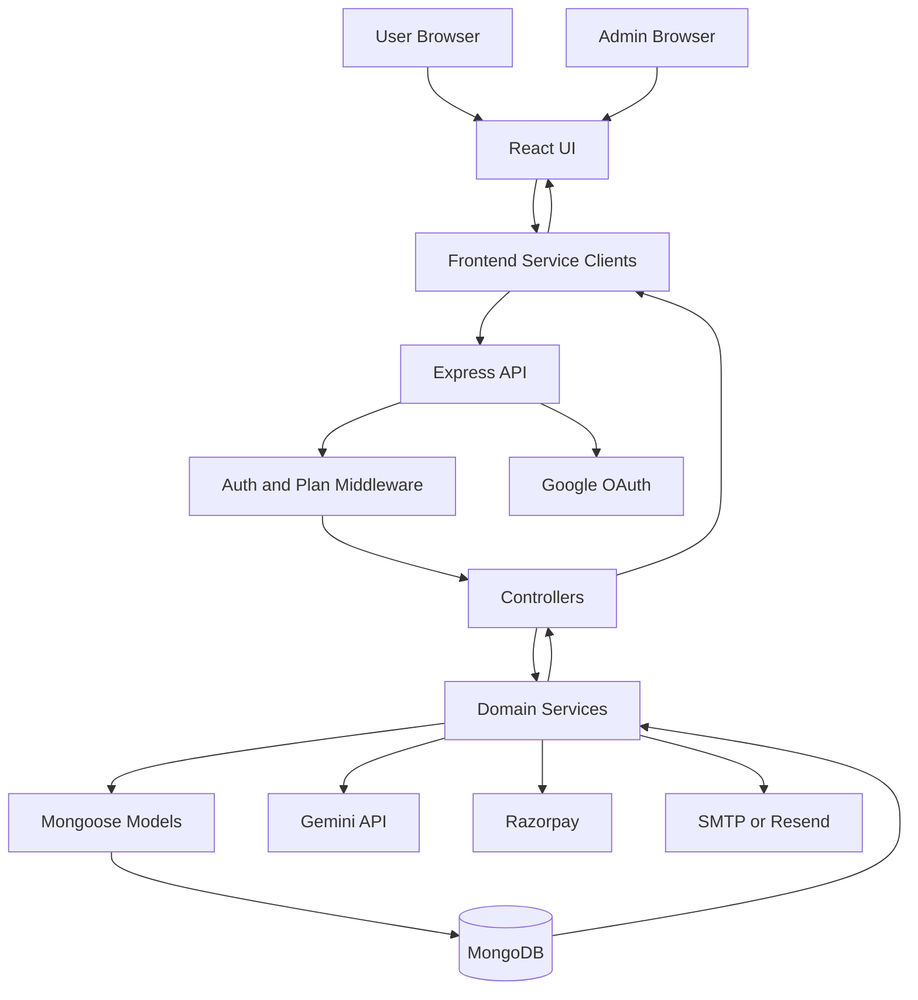
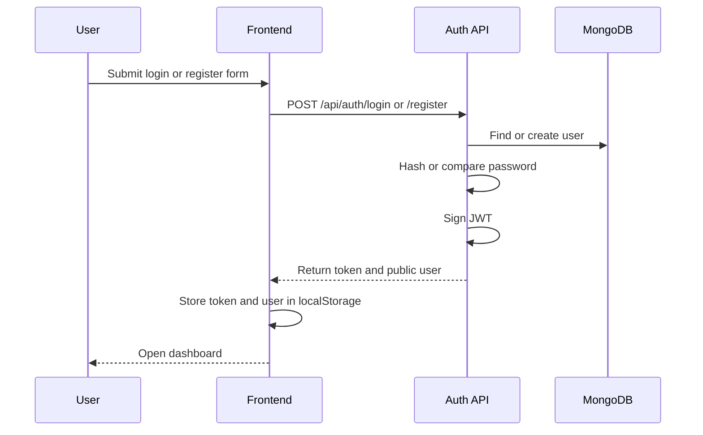
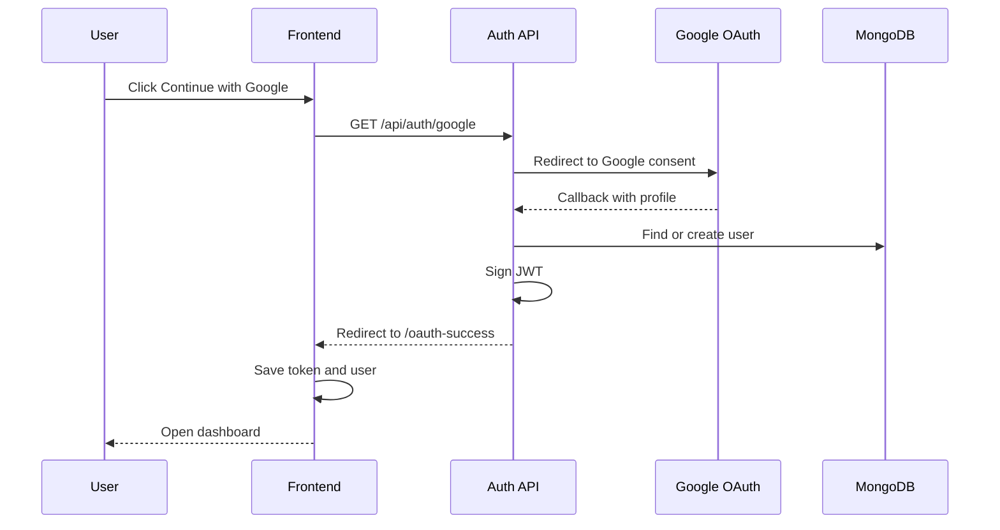
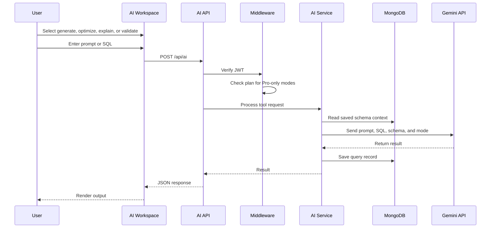
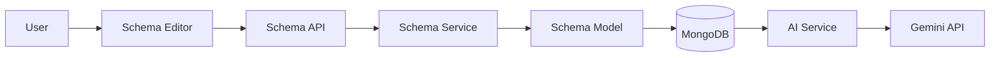
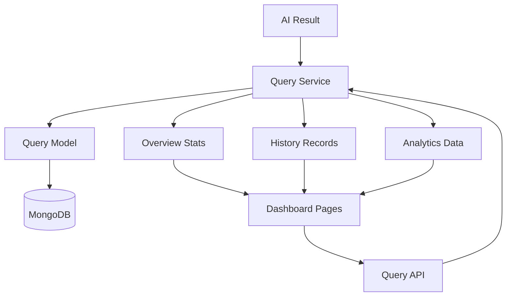
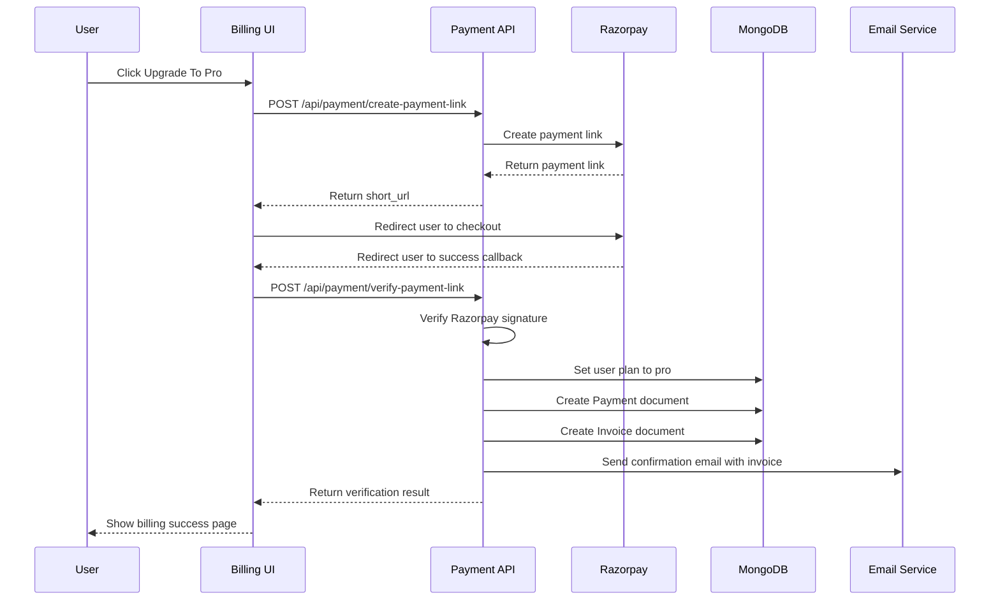
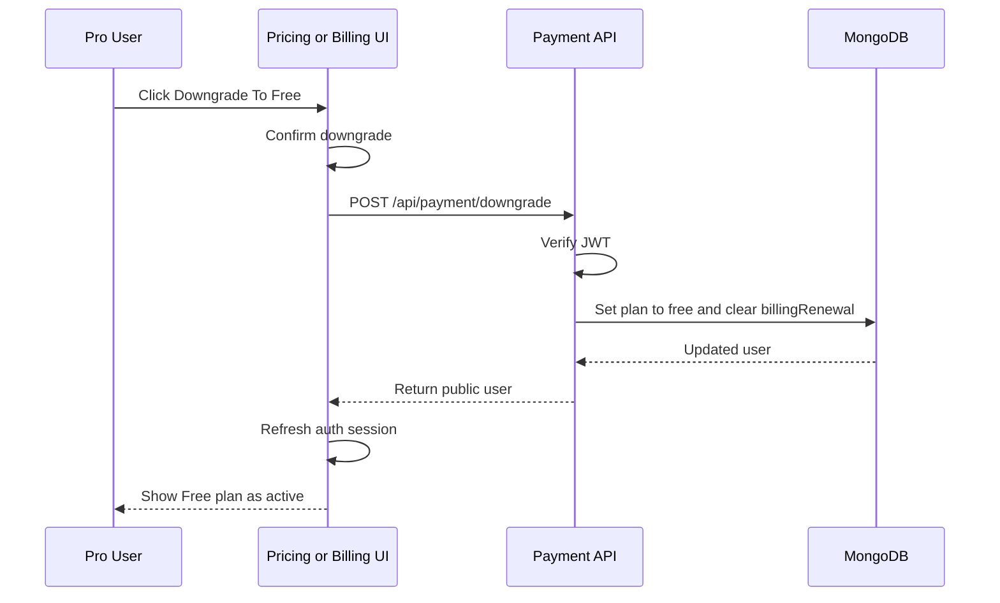
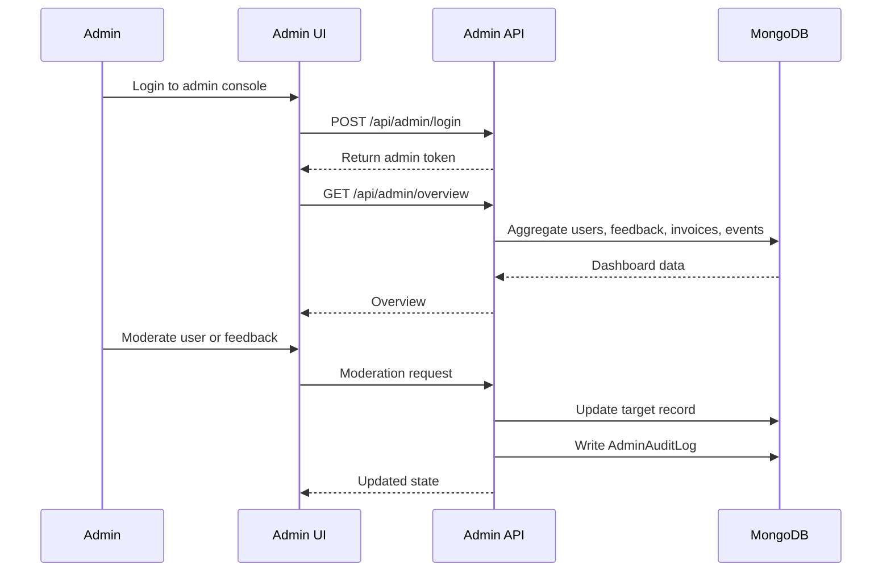
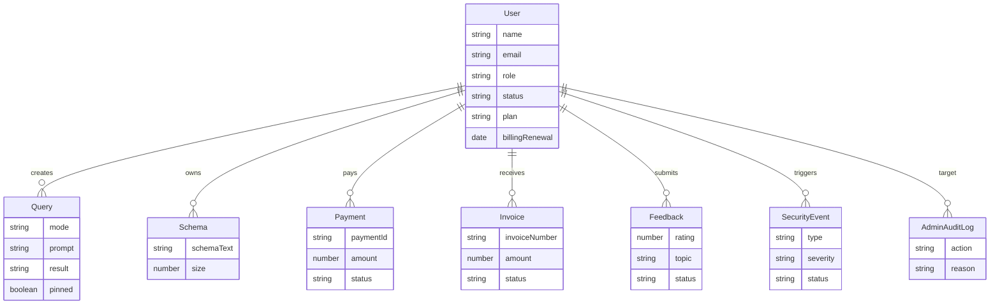

# Data Flow Diagrams

This document explains how data moves through AI SQL Studio across authentication, AI generation, billing, admin operations, and persistence.

## High-Level Data Flow

## Authentication Flow

## Google OAuth Flow

## AI Tool Flow

## Schema Context Flow

## Query History And Analytics Flow

## Billing Flow

## Downgrade Flow

## Admin Moderation Flow

## Persistence Map

