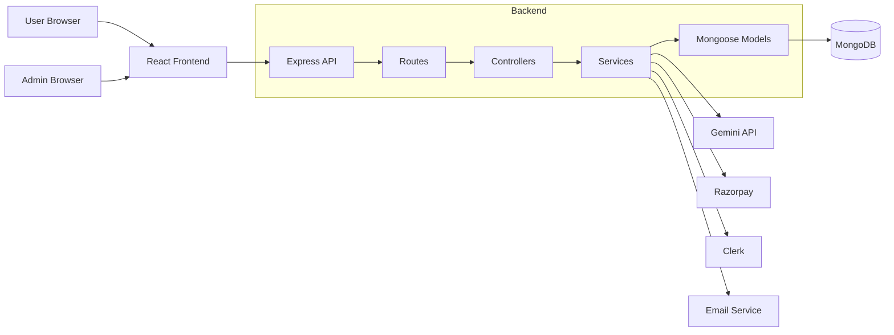

# AI SQL Studio

AI SQL Studio is a full-stack SaaS application for generating, improving, validating, formatting, and explaining SQL with AI. Users can save schema context, ask questions in plain English, review generated SQL, manage history, upgrade plans, submit feedback, and use a separate admin console for platform operations.

The project is built as a portfolio-ready product, not a small demo. It includes authentication, protected routing, responsive public and dashboard UI, AI tooling, billing, invoices, analytics, feedback, admin moderation, API documentation, tests, Docker files, and Render deployment configuration.

## Features

### Public App

- Responsive landing page with product, pricing, workflow, platform preview, and contact sections.
- Clerk login, signup, OAuth, and account session handling.
- Signed-in users are redirected back to the dashboard automatically.
- Developers showcase page.
- SEO metadata, robots file, sitemap, manifest, and favicon.

### User Dashboard

- Responsive dashboard layout with mobile sidebar navigation.
- Overview page for plan, usage, and recent activity.
- AI Workspace for:
  - Text-to-SQL generation.
  - Schema generation.
  - SQL optimization.
  - SQL formatting.
  - SQL validation.
  - SQL explanation.
- Schema Context page for saving database structure.
- Query History with search, filters, copy, export, delete, and Pro-only productivity tools.
- Pro Analytics with charts and workflow signals.
- Billing, invoices, settings, FAQ, support, and feedback pages.

### Backend

- Express API with route-controller-service-model separation.
- Clerk authentication and session-token based API access.
- Legacy JWT fallback support when enabled.
- MongoDB persistence with Mongoose models.
- Gemini AI integration with structured prompting, JSON repair, SQL formatting fallback, and history persistence.
- Plan access checks and free usage limits.
- Razorpay checkout, payment verification, webhook handling, invoices, and downgrade support.
- Admin API for users, feedback, security events, metrics, and audit logs.
- OpenAPI JSON endpoint.

### Admin Console

- Separate admin login.
- Dashboard metrics for users, revenue, feedback, plans, and security events.
- User search, pagination, plan updates, access decisions, suspension, and deletion.
- Feedback triage.
- Security-event review.
- Admin audit logging.

## Tech Stack

| Area | Technology |
| --- | --- |
| Frontend | React 19, Vite, React Router |
| Styling | Tailwind CSS v4, custom CSS variables |
| UI | Framer Motion, Lucide React |
| Charts | Recharts |
| Backend | Node.js, Express 5 |
| Database | MongoDB, Mongoose |
| Auth | Clerk |
| AI | Google Gemini |
| Payments | Razorpay |
| Email | Nodemailer |
| Tests | Vitest, Testing Library, backend API tests |
| Deployment | Docker, Render blueprint |

## Screenshots

### Public Website


### Admin Login


Screenshot assets are stored in `docs/screenshots`.

## Project Structure

```text
.
+-- Backend_Part/
|   +-- src/
|   |   +-- config/
|   |   +-- controllers/
|   |   +-- docs/
|   |   +-- middlewares/
|   |   +-- models/
|   |   +-- routes/
|   |   +-- services/
|   |   +-- utils/
|   |   +-- app.js
|   |   +-- server.js
|   +-- tests/
|   +-- Dockerfile
|   +-- package.json
|
+-- Frontend_Part/
|   +-- public/
|   +-- src/
|   |   +-- components/
|   |   +-- context/
|   |   +-- hooks/
|   |   +-- pages/
|   |   +-- providers/
|   |   +-- routes/
|   |   +-- services/
|   |   +-- utils/
|   |   +-- App.jsx
|   |   +-- main.jsx
|   +-- Dockerfile
|   +-- nginx.conf
|   +-- package.json
|
+-- docs/
|   +-- screenshots/
+-- docker-compose.yml
+-- render.yaml
+-- README.md
```

## Architecture



## Local Setup

### Prerequisites

- Node.js 18 or newer
- npm
- MongoDB connection string
- Clerk application keys
- Gemini API key
- Razorpay test keys, if testing billing
- SMTP credentials, if testing email

### Backend

```bash
cd Backend_Part
npm install
npm run dev
```

Default backend URL:

```text
http://localhost:5000
```

### Frontend

```bash
cd Frontend_Part
npm install
npm run dev
```

Default frontend URL:

```text
http://localhost:5173
```

## Environment Variables

### Backend `.env`

```env
PORT=5000
NODE_ENV=development
MONGO_URI=your_mongodb_connection_string
MONGO_URI_TEST=your_test_mongodb_connection_string

JWT_SECRET=generate-a-random-32-plus-character-secret
ADMIN_JWT_SECRET=generate-a-different-random-32-plus-character-secret
ENABLE_LEGACY_JWT_AUTH=false

CORS_ORIGIN=http://localhost:5173
FRONTEND_URL=http://localhost:5173

ADMIN_USER_ID=replace-with-admin-id
ADMIN_PASSWORD=use-a-strong-password-or-bcrypt-hash

CLERK_PUBLISHABLE_KEY=your_clerk_publishable_key
CLERK_SECRET_KEY=your_clerk_secret_key
CLERK_WEBHOOK_SECRET=your_clerk_webhook_secret
CLERK_ADMIN_USER_IDS=user_abc123,user_def456
CLERK_WAITLIST_MODE=false

GEMINI_API_KEY=your_gemini_api_key
GOOGLE_API_KEY=
GEMINI_MODEL=gemini-2.5-flash

RAZORPAY_KEY_ID=your_razorpay_key_id
RAZORPAY_SECRET=your_razorpay_secret
RAZORPAY_WEBHOOK_SECRET=your_razorpay_webhook_secret

EMAIL_USER=your_email
EMAIL_PASS=your_email_password
EMAIL_FROM=your_sender_email
RUN_SUBSCRIPTION_CRON=false
```

### Frontend `.env.local`

```env
VITE_API_BASE_URL=http://localhost:5000/api
VITE_CLERK_PUBLISHABLE_KEY=your_clerk_publishable_key
```

Do not commit `.env`, `.env.local`, API keys, database credentials, admin passwords, or payment secrets.

## Scripts

### Backend

| Command | Description |
| --- | --- |
| `npm run dev` | Start the backend in development |
| `npm start` | Start the backend in production mode |
| `npm test` | Run backend tests |

### Frontend

| Command | Description |
| --- | --- |
| `npm run dev` | Start Vite dev server |
| `npm run build` | Build production frontend |
| `npm run preview` | Preview production build |
| `npm run lint` | Run ESLint |
| `npm test` | Run frontend tests |

## Docker

Run the full stack locally with Docker:

```bash
docker compose up --build
```

Default Docker URLs:

```text
Frontend: http://localhost:5173
Backend:  http://localhost:5000
MongoDB:  mongodb://localhost:27017/sql-studio
```

## API Overview

The backend exposes the OpenAPI document at:

```text
GET /api/docs/openapi.json
```

Main API areas:

- `/api/auth` for session profile and logout.
- `/api/ai` for AI SQL tools.
- `/api/schema` for saved schema context.
- `/api/queries` for overview, history, analytics, tags, pins, favorites, and actions.
- `/api/payment` for billing, checkout, invoices, downgrade, and webhooks.
- `/api/feedback` for user feedback.
- `/api/admin` for admin dashboard operations.

## Database Models

| Model | Purpose |
| --- | --- |
| `User` | Account, Clerk ID, role, plan, usage, status, and risk data |
| `Query` | Prompt, generated SQL, AI mode, tags, pins, favorites, and action tracking |
| `Schema` | Saved schema context per user or workspace |
| `Payment` | Payment transaction records |
| `Invoice` | Billing invoice records |
| `Feedback` | User feedback and status |
| `SecurityEvent` | Security monitoring events |
| `AdminAuditLog` | Admin moderation and control actions |
| `OrganizationSubscription` | Organization-level billing state |
| `WebhookAuditLog` | Webhook processing audit trail |

## Deployment

The repository includes `render.yaml` for Render deployment.

Production checklist:

- Configure backend secrets in the hosting dashboard.
- Configure frontend build-time variables before deployment.
- Set `FRONTEND_URL` and `CORS_ORIGIN` to the deployed frontend URL.
- Set `VITE_API_BASE_URL` to the deployed backend `/api` URL.
- Configure Clerk allowed redirect URLs for `/login`, `/register`, and `/dashboard`.
- Configure Razorpay webhook URL as `https://your-backend-domain/api/payment/webhook`.
- Keep `node_modules`, `dist`, logs, coverage, cache folders, and environment files out of Git.

## Verification

Useful checks before pushing:

```bash
cd Backend_Part
npm test

cd ../Frontend_Part
npm run lint
npm test
npm run build
```

## GitHub Documentation Policy

`README.md` is the only root README intended for GitHub. Extra local planning or feature-note markdown files should stay out of the repository. The `.gitignore` includes rules for auxiliary note files such as `*_README.md` and `*_FEATURES.md`.

## Project Pitch

AI SQL Studio is a production-style full-stack project that demonstrates AI integration, authentication, protected dashboards, billing, analytics, admin operations, and responsive frontend engineering in one cohesive SaaS product.
