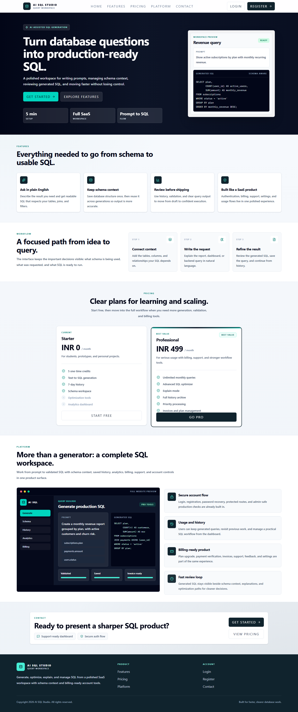
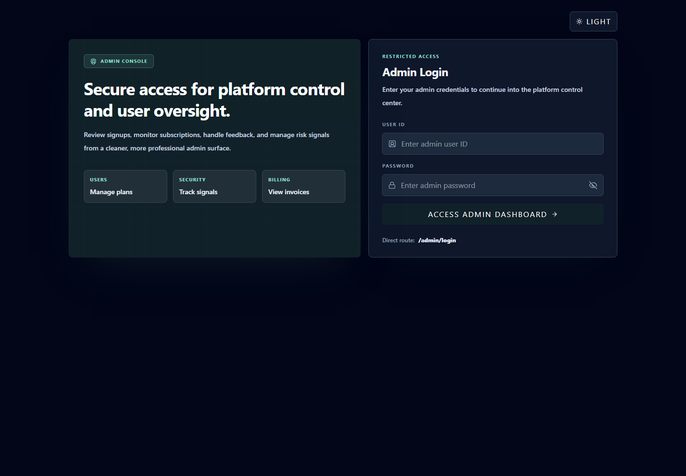
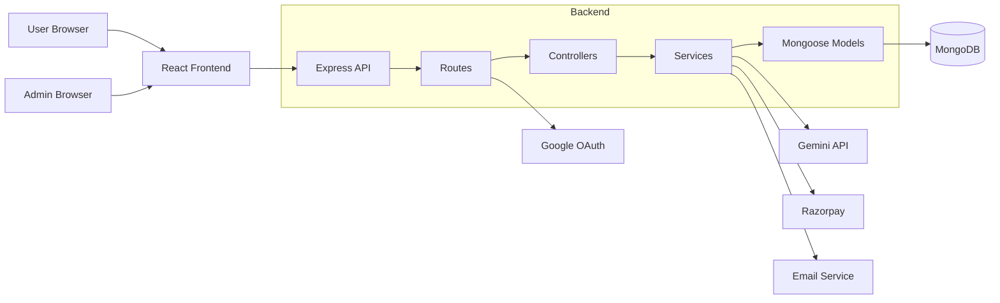
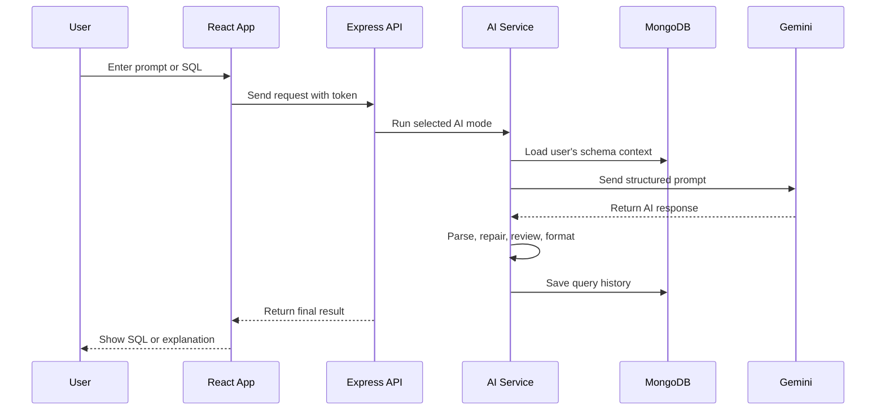

# AI SQL Studio

AI SQL Studio is a full-stack SaaS-style web application that helps developers generate, optimize, validate, format, and explain SQL using AI.

The goal of this project is not only to make SQL easier to write, but also to show how a real product is structured: authentication, protected dashboards, AI integration, saved history, schema-aware generation, billing, invoices, admin moderation, analytics, feedback, and deployment configuration.

This is a strong interview project because it demonstrates both frontend and backend thinking. It shows that you can build screens, APIs, database models, third-party integrations, and business rules that work together as one product.

## Table Of Contents

- [What This Project Does](#what-this-project-does)
- [Key Features](#key-features)
- [Tech Stack](#tech-stack)
- [Screenshots](#screenshots)
- [Project Structure](#project-structure)
- [Architecture](#architecture)
- [Advanced Code To Highlight In Interviews](#advanced-code-to-highlight-in-interviews)
- [Beginner-Friendly Explanation](#beginner-friendly-explanation)
- [Getting Started](#getting-started)
- [Docker Quick Start](#docker-quick-start)
- [Environment Variables](#environment-variables)
- [Available Scripts](#available-scripts)
- [API Overview](#api-overview)
- [Database Models](#database-models)
- [Deployment](#deployment)
- [SEO, Security, And Quality Status](#seo-security-and-quality-status)
- [Interview Talking Points](#interview-talking-points)

## What This Project Does

Many developers know what data they want, but they struggle to write the correct SQL query quickly. AI SQL Studio solves that problem by allowing users to save their database schema and then ask the AI for SQL queries in plain English.

Example:

```text
Show me the top 5 customers by total order amount this month.
```

The app can generate SQL based on the saved schema, optimize existing SQL, explain how a query works, validate/fix SQL, and save the result in query history.

## Key Features

### Public Website

- Landing page for the product.
- Login and registration.
- Forgot password with OTP reset flow.
- Google OAuth login.
- Developers page.
- Light and dark theme support.

### User Dashboard

- Dashboard overview with usage and activity.
- AI workspace for SQL generation, optimization, validation, formatting, and explanation.
- Schema context page where users save database structure.
- Query history with copy, `.sql` export, delete, filtering, and Pro-only pinning.
- Analytics page for Pro users.
- Billing, invoices, settings, FAQ, support, and feedback pages.

### AI SQL Features

- Natural language to SQL generation.
- Syntax-highlighted SQL editor for SQL-focused modes.
- Export generated SQL and history entries as `.sql` files.
- Schema-aware prompt building.
- Strict JSON response handling from the AI model.
- AI response repair when the model returns invalid JSON.
- SQL formatting fallback.
- Query completion when an AI response is incomplete.
- Second-pass SQL review for generated queries.
- Usage limits for free users.
- Pro-only access for advanced AI modes.

### Billing And Subscription

- Razorpay payment link and order support.
- Signature verification for payment safety.
- Razorpay webhook verification for server-to-server payment confirmation.
- Pro plan activation after successful payment.
- Invoice and payment record creation.
- Email confirmation with invoice attachment.
- Subscription renewal date handling.
- User downgrade from Pro to Free.
- Scheduled expired-subscription downgrade logic.

### Admin Console

- Separate admin login.
- Admin dashboard with platform metrics.
- User listing with pagination and search.
- User moderation: upgrade, downgrade, suspend, unsuspend, delete.
- Feedback triage.
- Security event monitoring.
- Admin audit logs for moderation actions.
- Revenue, signup, plan, feedback, and security summaries.

## Tech Stack

| Layer | Technology |
| --- | --- |
| Frontend | React 19, Vite, React Router |
| Styling | Tailwind CSS v4, custom CSS variables |
| UI Motion | Framer Motion |
| Charts | Recharts |
| Icons | Lucide React, React Icons |
| Backend | Node.js, Express 5 |
| Database | MongoDB, Mongoose |
| Authentication | JWT, bcrypt, Passport Google OAuth |
| AI | Google Gemini API |
| Payments | Razorpay |
| Email | Nodemailer |
| Scheduled Jobs | node-cron |
| API Documentation | OpenAPI 3.0 JSON |
| Deployment | Render blueprint |

## Screenshots

These screenshots give interviewers a quick visual walkthrough of the project: the full public website and admin authentication.

### Full Website Screenshot

The full public website screenshot shows the hero, feature overview, workflow, pricing cards, platform preview, contact block, and footer.



### Admin Login

The admin login screen shows the separate admin access flow used for moderation and platform management.



All screenshot assets are stored in `docs/screenshots`.

## Project Structure

```text
.
+-- Backend_Part/
|   +-- src/
|   |   +-- config/           # Database, OAuth, and environment validation
|   |   +-- controllers/      # Request handlers
|   |   +-- docs/             # OpenAPI document
|   |   +-- middlewares/      # Auth, validation, plan guards, errors
|   |   +-- models/           # MongoDB/Mongoose schemas
|   |   +-- routes/           # API route definitions
|   |   +-- services/         # Main business logic
|   |   +-- utils/            # Helpers for auth, email, AI, responses
|   |   +-- app.js            # Express app setup
|   |   +-- server.js         # Server startup
|   +-- tests/                # Backend API and environment tests
|   +-- Dockerfile
|   +-- package.json
|
+-- Frontend_Part/
|   +-- public/               # SEO files, favicon, robots, sitemap, manifest
|   +-- src/
|   |   +-- components/       # Reusable UI, SEO metadata, route guards
|   |   +-- context/          # Auth, admin auth, theme state
|   |   +-- hooks/            # Custom React hooks
|   |   +-- pages/            # Public, dashboard, billing, admin pages
|   |   +-- routes/           # Route tree
|   |   +-- services/         # API service functions
|   |   +-- utils/            # Browser storage helpers
|   |   +-- test/             # Frontend test setup
|   |   +-- App.jsx
|   |   +-- main.jsx
|   +-- package.json
|   +-- Dockerfile
|   +-- nginx.conf
|
+-- docs/
|   +-- data-flow.md
|   +-- screenshots/
+-- docker-compose.yml
+-- render.yaml
+-- .gitignore
+-- README.md
```

## Architecture

The app follows a clean full-stack separation.



### AI Request Flow



## Advanced Code To Highlight In Interviews

Use this section when explaining the project to an interviewer.

### 1. AI Service Design

File: `Backend_Part/src/services/ai.service.js`

This is one of the strongest parts of the project.

What makes it advanced:

- Different system prompts for generate, optimize, validate, explain, and format modes.
- Schema-aware SQL generation, so the AI is guided by the user's saved database structure.
- Strict JSON contract expected from the AI model.
- Safe JSON parsing and repair when the AI returns messy text.
- Second-pass review for generated SQL.
- Incomplete SQL detection and completion retry.
- SQL formatting fallback.
- Free-plan usage limit and Pro-only feature checks.
- Query history save after successful AI output.

How to explain it simply:

> I did not just call the AI API and print the response. I created a service layer that validates the request, adds schema context, controls the AI output format, repairs invalid responses, reviews generated SQL, formats the final result, checks plan limits, and stores the query history.

### 2. Billing And Payment Verification

File: `Backend_Part/src/services/payment.service.js`

What makes it advanced:

- Razorpay order and payment-link support.
- HMAC signature verification.
- Raw-body webhook verification using Razorpay's webhook signature.
- Payment status validation.
- Pro plan activation after verified payment.
- Invoice and payment record creation.
- Email confirmation with generated invoice.
- Duplicate verification protection using existing invoice lookup.

How to explain it simply:

> The payment flow verifies Razorpay signatures before upgrading the user. After payment, the backend activates the Pro plan, stores payment details, creates an invoice, and sends a confirmation email.

### 3. Admin Dashboard And Moderation

File: `Backend_Part/src/services/admin.service.js`

What makes it advanced:

- Admin authentication separate from user authentication.
- Aggregated dashboard metrics using MongoDB aggregation.
- User pagination and search.
- Moderation actions with required reasons.
- Audit logs for admin actions.
- Security event creation when risky actions happen.
- Feedback and security-event triage.

How to explain it simply:

> The admin system is not just a static page. It reads platform data, summarizes business metrics, lets admins take action on users, and keeps audit logs so important actions are traceable.

### 4. Protected Frontend Routing

File: `Frontend_Part/src/routes/AppRoutes.jsx`

What makes it advanced:

- Public routes for landing/login/register.
- Protected user dashboard routes.
- Separate protected admin dashboard route.
- Redirects for old or shortcut URLs.
- Nested dashboard layout with child pages.

How to explain it simply:

> The frontend has route guards, so normal users, logged-out visitors, and admins see the correct screens.

### 5. Separation Of Concerns

The backend is split into routes, controllers, services, models, middleware, and utilities.

Why this matters:

- Routes define URLs.
- Controllers handle request and response.
- Services contain business logic.
- Models define database structure.
- Middleware handles auth, validation, and errors.
- Utilities handle reusable helpers.

This structure is interview-friendly because it shows you understand maintainable backend architecture.

## Beginner-Friendly Explanation

Think of the app like a restaurant.

- The frontend is the dining area where users interact.
- The backend routes are the waiters taking requests.
- Controllers decide which service should handle the request.
- Services are the kitchen where the real work happens.
- Models are the storage shelves where data is organized.
- MongoDB is the database where everything is saved.
- Gemini is the AI chef that helps create SQL.
- Razorpay is the cashier for Pro subscriptions.
- Admin dashboard is the manager's office.

When a user asks for SQL:

1. The user enters a prompt in the React dashboard.
2. The frontend sends it to the Express backend.
3. The backend checks if the user is logged in.
4. The AI service loads the user's saved schema.
5. The app sends a carefully written prompt to Gemini.
6. The response is parsed, repaired if needed, reviewed, and formatted.
7. The final SQL is saved in history.
8. The frontend displays the result.

## Getting Started

### Prerequisites

- Node.js 18 or newer
- npm
- MongoDB database
- Gemini API key
- Razorpay test credentials
- Optional Google OAuth credentials
- Optional email SMTP credentials

### 1. Install Backend Dependencies

```bash
cd Backend_Part
npm install
```

### 2. Install Frontend Dependencies

```bash
cd ../Frontend_Part
npm install
```

### 3. Create Backend Environment File

Create `Backend_Part/.env` and add the backend variables listed below.

### 4. Create Frontend Environment File

Create `Frontend_Part/.env.local` and add the frontend variables listed below.

### 5. Run Backend

```bash
cd Backend_Part
npm run dev
```

Backend runs on:

```text
http://localhost:5000
```

### 6. Run Frontend

```bash
cd Frontend_Part
npm run dev
```

Frontend runs on:

```text
http://localhost:5173
```

## Docker Quick Start

The project includes Dockerfiles for the backend and frontend, plus a root `docker-compose.yml` for local full-stack startup with MongoDB.

```bash
docker compose up --build
```

Local Docker URLs:

```text
Frontend: http://localhost:5173
Backend:  http://localhost:5000
MongoDB:  mongodb://localhost:27017/sql-studio
```

Set `GEMINI_API_KEY` or `GOOGLE_API_KEY` in the backend service environment before using AI features. Add Razorpay, Google OAuth, and email secrets the same way when testing those integrations locally.
For Razorpay webhooks, configure the dashboard webhook URL as `https://your-backend-domain/api/payment/webhook` and store the webhook signing secret in `RAZORPAY_WEBHOOK_SECRET`.

## Environment Variables

### Backend `.env`

```env
PORT=5000
NODE_ENV=development
MONGO_URI=your_mongodb_connection_string
MONGO_URI_TEST=your_test_mongodb_connection_string
JWT_SECRET=your_jwt_secret
CORS_ORIGIN=http://localhost:5173
FRONTEND_URL=http://localhost:5173
ADMIN_USER_ID=admin
ADMIN_PASSWORD=change_this_password

GOOGLE_CLIENT_ID=your_google_client_id
GOOGLE_CLIENT_SECRET=your_google_client_secret

GEMINI_API_KEY=your_gemini_api_key
# Or use GOOGLE_API_KEY instead of GEMINI_API_KEY.
# Set only one Gemini key in production.
GOOGLE_API_KEY=
GEMINI_MODEL=gemini-2.5-flash

RAZORPAY_KEY_ID=your_razorpay_key_id
RAZORPAY_SECRET=your_razorpay_secret
RAZORPAY_WEBHOOK_SECRET=your_razorpay_webhook_secret

EMAIL_USER=your_email
EMAIL_PASS=your_email_password
EMAIL_FROM=your_sender_email
```

Production startup validates required backend environment variables before the app boots.
For `NODE_ENV=production`, set `JWT_SECRET`, `MONGO_URI`, `ADMIN_USER_ID`, `ADMIN_PASSWORD`, `FRONTEND_URL`, `CORS_ORIGIN`, and either `GEMINI_API_KEY` or `GOOGLE_API_KEY`.
Optional integrations are validated only when configured, for example Google OAuth requires both Google secrets and Razorpay requires both payment secrets. Razorpay webhooks additionally require `RAZORPAY_WEBHOOK_SECRET`.
Use a strong admin password with at least 12 characters, or store a bcrypt hash in `ADMIN_PASSWORD`.

### Frontend `.env.local`

```env
VITE_API_BASE_URL=http://localhost:5000/api
VITE_GOOGLE_AUTH_URL=http://localhost:5000/api/auth/google
```

## Available Scripts

### Backend

| Command | Description |
| --- | --- |
| `npm run dev` | Start backend server |
| `npm start` | Start backend in production mode |
| `npm test` | Run backend API and environment validation tests |

### Frontend

| Command | Description |
| --- | --- |
| `npm run dev` | Start Vite dev server |
| `npm run build` | Build frontend for production |
| `npm run preview` | Preview production build |
| `npm run lint` | Run ESLint |
| `npm test` | Run frontend unit tests |

## API Overview

The machine-readable OpenAPI document is available from the backend at:

```text
GET /api/docs/openapi.json
```

### Auth

| Method | Endpoint | Description |
| --- | --- | --- |
| `POST` | `/api/auth/register` | Register a user |
| `POST` | `/api/auth/login` | Login user |
| `POST` | `/api/auth/forgot-password` | Send reset OTP |
| `POST` | `/api/auth/verify-otp` | Verify OTP and reset password |
| `GET` | `/api/auth/me` | Get current user |
| `PUT` | `/api/auth/update-profile` | Update profile |
| `PUT` | `/api/auth/change-password` | Change password |
| `DELETE` | `/api/auth/delete-account` | Delete account |
| `GET` | `/api/auth/google` | Start Google OAuth |

### AI And Query History

| Method | Endpoint | Description |
| --- | --- | --- |
| `POST` | `/api/ai` | Run AI SQL tool |
| `GET` | `/api/queries/overview` | Dashboard overview |
| `GET` | `/api/queries` | Query history |
| `GET` | `/api/queries/analytics` | Basic analytics |
| `GET` | `/api/queries/advanced-analytics` | Pro analytics |
| `PATCH` | `/api/queries/:id/pin` | Pin query |
| `DELETE` | `/api/queries/:id` | Delete query |

### Schema

| Method | Endpoint | Description |
| --- | --- | --- |
| `GET` | `/api/schema` | Get saved schema |
| `POST` | `/api/schema` | Save schema |
| `DELETE` | `/api/schema` | Delete schema |

### Payments

| Method | Endpoint | Description |
| --- | --- | --- |
| `POST` | `/api/payment/create-order` | Create Razorpay order |
| `POST` | `/api/payment/create-payment-link` | Create Razorpay payment link |
| `POST` | `/api/payment/verify` | Verify order payment |
| `POST` | `/api/payment/verify-payment-link` | Verify hosted payment link |
| `POST` | `/api/payment/webhook` | Verify Razorpay webhook |
| `POST` | `/api/payment/downgrade` | Downgrade to Free |
| `GET` | `/api/payment/invoices` | Get invoices |

### Feedback

| Method | Endpoint | Description |
| --- | --- | --- |
| `POST` | `/api/feedback` | Submit feedback |
| `GET` | `/api/feedback/mine` | Get current user's feedback |

### Admin

| Method | Endpoint | Description |
| --- | --- | --- |
| `POST` | `/api/admin/login` | Admin login |
| `POST` | `/api/admin/logout` | Admin logout |
| `GET` | `/api/admin/me` | Get admin profile |
| `GET` | `/api/admin/overview` | Admin dashboard data |
| `GET` | `/api/admin/users` | List users |
| `POST` | `/api/admin/users/:userId/moderate` | Moderate user: set Pro, set Free, suspend, unsuspend, or delete |
| `GET` | `/api/admin/feedback` | List feedback |
| `PATCH` | `/api/admin/feedback/:feedbackId/status` | Update feedback status |
| `GET` | `/api/admin/security-events` | List security events |
| `PATCH` | `/api/admin/security-events/:eventId/status` | Update security event status |

## Database Models

| Model | Purpose |
| --- | --- |
| `User` | Stores account, plan, usage, auth, and risk data |
| `Query` | Stores prompts, generated SQL, mode, and history |
| `Schema` | Stores user's database schema context |
| `Payment` | Stores payment transaction data |
| `Invoice` | Stores billing invoice data |
| `Feedback` | Stores user feedback |
| `SecurityEvent` | Stores suspicious or important security events |
| `AdminAuditLog` | Stores admin moderation history |

## Deployment

The repository includes `render.yaml` for Render deployment.

Production checklist:

- Add all backend secrets in the hosting dashboard.
- Add frontend environment variables before building the frontend.
- Set `CORS_ORIGIN` and `FRONTEND_URL` to the deployed frontend URL.
- Set `VITE_API_BASE_URL` to the deployed backend `/api` URL.
- Use strong admin credentials.
- Do not commit `.env` files.
- Keep generated folders such as `dist`, `node_modules`, coverage output, logs, and browser cache folders out of Git.

## SEO, Security, And Quality Status

This pass cleaned the production-facing website and project structure.

### SEO Readiness

- The frontend now has a production title, meta description, keywords, author, theme color, canonical URL, Open Graph tags, and Twitter metadata in `Frontend_Part/index.html`.
- Route-level metadata is handled by `Frontend_Part/src/components/Seo.jsx`.
- Public pages such as `/` and `/developers` are indexable.
- Private, admin, billing, OAuth, and dashboard routes are marked `noindex,follow` from the React route metadata layer.
- `Frontend_Part/public/robots.txt`, `sitemap.xml`, `site.webmanifest`, and `favicon.svg` are included.
- The unused global Razorpay checkout script was removed from `index.html`; payments are handled by backend/payment services instead.

### Security And Leakage Check

- Backend and frontend dependency audits reported `0 vulnerabilities`.
- `.env` files are ignored and should stay local only.
- Production backend startup validates required environment variables before the app boots.
- Admin credentials, JWT secret, MongoDB URI, Gemini key, Google OAuth secrets, Razorpay secrets, and email credentials must be configured in the hosting dashboard, not committed.
- Console logging is centralized through logger utilities instead of scattered `console.*` calls.

### Cleanup And Structure

- Removed tracked `.tmp-chrome` browser profile/cache output.
- Removed stale Vite template assets and old subproject README files.
- Removed an unused backend root `server.js` wrapper; `Backend_Part/package.json` starts `src/server.js` directly.
- Added a root `.gitignore` so generated files, logs, dependencies, local environment files, build output, coverage, cache, and temporary browser files do not enter Git again.
- The root `README.md` is the canonical public documentation for GitHub.

### Verification Commands

These checks passed locally during the cleanup:

```bash
cd Backend_Part
npm audit --audit-level=moderate
npm test

cd ../Frontend_Part
npm audit --audit-level=moderate
npm run lint
npm test
npm run build
```

## Interview Talking Points

Use these points when presenting the project.

### Short Project Pitch

> AI SQL Studio is a full-stack SaaS application that helps users generate and manage SQL queries using AI. It includes authentication, schema-aware AI generation, query history, Pro billing, invoices, feedback, analytics, and an admin console.

### What I Built

- Built a React/Vite frontend with public pages, protected dashboard pages, admin pages, and theme support.
- Built an Express/MongoDB backend with clean route-controller-service-model separation.
- Integrated Gemini for AI-powered SQL generation and explanation.
- Added schema context so generated SQL can match the user's real database.
- Added Razorpay billing and invoice generation for Pro subscriptions.
- Built an admin dashboard with metrics, user moderation, feedback triage, and security monitoring.

### Most Advanced Part

The AI service is the most advanced part because it handles prompt design, schema grounding, strict JSON parsing, fallback repair, SQL review, incomplete SQL completion, formatting, usage limits, and query persistence.

### What I Learned

- How to structure a full-stack project.
- How to protect routes on both frontend and backend.
- How to integrate an AI API into a real user workflow.
- How to manage subscription features and billing state.
- How to design admin features with auditability.
- How to think about security, rate limits, validation, and production readiness.

## Current Status

This project is a strong intermediate-to-advanced portfolio project. It is suitable for interviews because it demonstrates real product features, not only CRUD operations.
