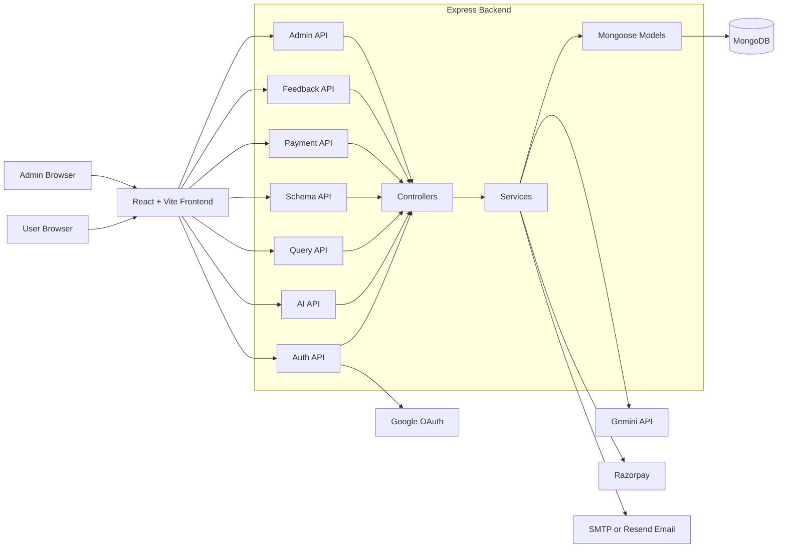
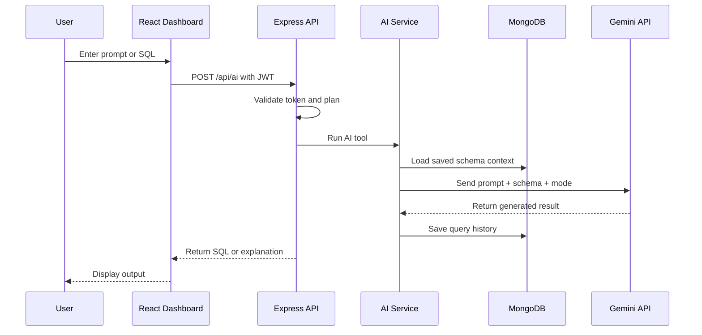
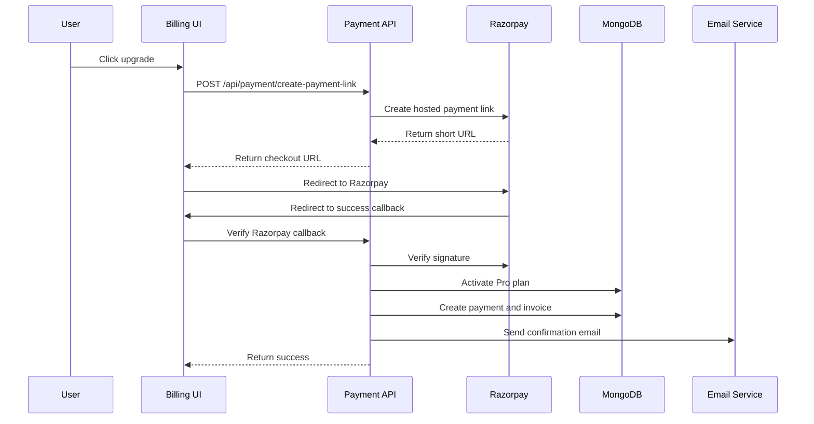

# AI SQL Studio

AI SQL Studio is a full-stack SaaS application for generating, optimizing, validating, and explaining SQL with AI. It includes user authentication, Google OAuth, schema-aware query generation, saved query history, Pro billing through Razorpay, invoices, feedback, support pages, and an admin control center for user and platform management.

The project is structured as a React frontend and an Express/MongoDB backend, with clear separation between UI, API services, controllers, business logic, and database models.

## Table Of Contents

- [Features](#features)
- [Tech Stack](#tech-stack)
- [Project Structure](#project-structure)
- [System Architecture](#system-architecture)
- [Data Flow](#data-flow)
- [Getting Started](#getting-started)
- [Environment Variables](#environment-variables)
- [Available Scripts](#available-scripts)
- [API Overview](#api-overview)
- [Database Models](#database-models)
- [Billing And Plans](#billing-and-plans)
- [Admin Console](#admin-console)
- [Deployment](#deployment)
- [Troubleshooting](#troubleshooting)

## Features

### Public Website

- Professional landing page with product sections, pricing, developers, FAQ, and support entry points.
- Responsive login and registration flows.
- Forgot password and OTP-based reset flow.
- Google OAuth sign-in support.
- Light and dark mode support.

### User Dashboard

- Workspace overview with plan status, usage stats, recent activity, and quick actions.
- AI Workspace for:
  - Natural language to SQL generation.
  - SQL optimization.
  - SQL explanation.
  - SQL validation.
- Schema context storage so AI output can follow the user's real database structure.
- Query history with search, filtering, pinning for Pro users, copy, and delete actions.
- Analytics dashboard for Pro users.
- Pricing, billing, invoices, settings, support, FAQ, and feedback pages.

### Billing

- Razorpay hosted checkout integration.
- Payment link creation and verification.
- Pro plan activation after successful payment.
- Invoice and payment record creation.
- Subscription renewal tracking.
- User self-downgrade from Pro to Free.
- Expired subscription downgrade job.

### Admin Console

- Secure admin login.
- Platform overview with users, revenue, feedback, invoices, and security signals.
- User moderation:
  - Set Pro or Free plan.
  - Suspend or unsuspend users.
  - Delete users.
- Feedback triage.
- Security event monitoring and status updates.
- Admin audit logging.

## Tech Stack

| Layer | Technology |
| --- | --- |
| Frontend | React 19, Vite, React Router |
| Styling | Tailwind CSS v4, custom CSS variables, responsive light/dark UI |
| Animation | Framer Motion |
| Charts | Recharts |
| Icons | Lucide React |
| Backend | Node.js, Express 5 |
| Database | MongoDB, Mongoose |
| Authentication | JWT, bcrypt, Passport Google OAuth |
| AI Provider | Google Gemini API |
| Payments | Razorpay |
| Email | Nodemailer SMTP or Resend API |
| Deployment | Render blueprint support |

## Project Structure

```text
.
+-- Backend_Part/
|   +-- src/
|   |   +-- config/           # Database and Passport OAuth config
|   |   +-- controllers/      # Route handlers
|   |   +-- middlewares/      # Auth, validation, errors, plan guards
|   |   +-- models/           # Mongoose models
|   |   +-- routes/           # API route definitions
|   |   +-- services/         # Business logic
|   |   +-- utils/            # JWT, email, AI client, security monitor
|   |   +-- app.js            # Express app setup
|   |   +-- server.js         # Server bootstrap
|   +-- .env.example
|   +-- package.json
|
+-- Frontend_Part/
|   +-- src/
|   |   +-- components/       # Shared UI, auth, layout, AI controls
|   |   +-- context/          # Auth, admin auth, theme providers
|   |   +-- hooks/            # React hooks
|   |   +-- pages/            # Public, dashboard, billing, admin pages
|   |   +-- routes/           # App route tree
|   |   +-- services/         # API clients
|   |   +-- utils/            # Storage helpers
|   |   +-- App.jsx
|   |   +-- main.jsx
|   +-- .env.example
|   +-- package.json
|
+-- docs/
|   +-- data-flow.md
+-- render.yaml
+-- readme.md
```

## System Architecture



## Data Flow

A detailed version is available in [docs/data-flow.md](docs/data-flow.md).

### AI Query Generation Flow



### Billing Flow



## Getting Started

### Prerequisites

- Node.js 18 or newer
- npm
- MongoDB database
- Gemini API key
- Razorpay test or live credentials
- Optional Google OAuth credentials
- Optional SMTP or Resend credentials for emails

### 1. Clone the repository

```bash
git clone <your-repository-url>
cd SQL
```

### 2. Install dependencies

```bash
cd Backend_Part
npm install

cd ../Frontend_Part
npm install
```

### 3. Configure environment variables

Create backend env file:

```bash
cd Backend_Part
cp .env.example .env
```

Create frontend env file:

```bash
cd ../Frontend_Part
cp .env.example .env.local
```

Update the values for your local or deployed services.

### 4. Run the backend

```bash
cd Backend_Part
npm run dev
```

The backend runs on:

```text
http://localhost:5000
```

### 5. Run the frontend

```bash
cd Frontend_Part
npm run dev
```

The frontend runs on:

```text
http://localhost:5173
```

## Environment Variables

### Backend

See [Backend_Part/.env.example](Backend_Part/.env.example).

| Variable | Description |
| --- | --- |
| `PORT` | Backend port, usually `5000` |
| `NODE_ENV` | `development` or `production` |
| `MONGO_URI` | MongoDB connection string |
| `JWT_SECRET` | Secret used to sign JWTs |
| `CORS_ORIGIN` | Allowed frontend origin |
| `FRONTEND_URL` | Frontend URL used for OAuth and payment callbacks |
| `GOOGLE_CLIENT_ID` | Google OAuth client ID |
| `GOOGLE_CLIENT_SECRET` | Google OAuth client secret |
| `GEMINI_API_KEY` | Gemini API key |
| `RAZORPAY_KEY_ID` | Razorpay key ID |
| `RAZORPAY_SECRET` | Razorpay secret |
| `ADMIN_USER_ID` | Admin login user ID |
| `ADMIN_PASSWORD` | Admin login password |
| `EMAIL_PROVIDER` | `smtp` or `resend` |
| `EMAIL_USER` | SMTP email user |
| `EMAIL_PASS` | SMTP email password |
| `EMAIL_FROM` | Email sender |
| `RESEND_API_KEY` | Resend API key |

### Frontend

See [Frontend_Part/.env.example](Frontend_Part/.env.example).

| Variable | Description |
| --- | --- |
| `VITE_API_BASE_URL` | Backend API base URL |
| `VITE_GOOGLE_AUTH_URL` | Google OAuth redirect URL |

For local development:

```env
VITE_API_BASE_URL=http://localhost:5000/api
VITE_GOOGLE_AUTH_URL=http://localhost:5000/api/auth/google
```

## Available Scripts

### Backend

| Command | Description |
| --- | --- |
| `npm run dev` | Start the Express server |
| `npm start` | Start the production server |
| `npm test` | Run backend smoke test imports |

### Frontend

| Command | Description |
| --- | --- |
| `npm run dev` | Start Vite dev server |
| `npm run build` | Build frontend for production |
| `npm run preview` | Preview production build |
| `npm run lint` | Run ESLint |

## API Overview

### Auth

| Method | Endpoint | Description |
| --- | --- | --- |
| `POST` | `/api/auth/register` | Register a user |
| `POST` | `/api/auth/login` | Login with email and password |
| `POST` | `/api/auth/forgot-password` | Send reset OTP |
| `POST` | `/api/auth/verify-otp` | Reset password with OTP |
| `GET` | `/api/auth/me` | Get current user |
| `PUT` | `/api/auth/update-profile` | Update profile |
| `PUT` | `/api/auth/change-password` | Change password |
| `DELETE` | `/api/auth/delete-account` | Delete account |
| `GET` | `/api/auth/google` | Start Google OAuth |
| `GET` | `/api/auth/google/callback` | Google OAuth callback |

### AI And Queries

| Method | Endpoint | Description |
| --- | --- | --- |
| `POST` | `/api/ai` | Run generate, optimize, explain, or validate |
| `GET` | `/api/queries/overview` | Dashboard overview |
| `GET` | `/api/queries` | Query history |
| `GET` | `/api/queries/analytics` | Basic analytics |
| `GET` | `/api/queries/advanced-analytics` | Pro analytics |
| `PATCH` | `/api/queries/:id/pin` | Pin a query, Pro only |
| `DELETE` | `/api/queries/:id` | Delete a query |

### Schema

| Method | Endpoint | Description |
| --- | --- | --- |
| `GET` | `/api/schema` | Load saved schema |
| `POST` | `/api/schema` | Save schema context |
| `DELETE` | `/api/schema` | Delete schema context |

### Payments

| Method | Endpoint | Description |
| --- | --- | --- |
| `POST` | `/api/payment/create-order` | Create Razorpay order |
| `POST` | `/api/payment/create-payment-link` | Create Razorpay payment link |
| `POST` | `/api/payment/verify` | Verify Razorpay order payment |
| `POST` | `/api/payment/verify-payment-link` | Verify payment link callback |
| `POST` | `/api/payment/downgrade` | Downgrade Pro user to Free |
| `GET` | `/api/payment/invoices` | Get user invoices |

### Feedback

| Method | Endpoint | Description |
| --- | --- | --- |
| `POST` | `/api/feedback` | Submit feedback |
| `GET` | `/api/feedback/mine` | Get current user's feedback |

### Admin

| Method | Endpoint | Description |
| --- | --- | --- |
| `POST` | `/api/admin/login` | Admin login |
| `GET` | `/api/admin/me` | Get current admin session |
| `GET` | `/api/admin/overview` | Admin dashboard overview |
| `GET` | `/api/admin/users` | List users |
| `POST` | `/api/admin/users/:userId/moderate` | Suspend, unsuspend, set plan, or delete user |
| `PATCH` | `/api/admin/users/:userId/plan` | Update user plan |
| `DELETE` | `/api/admin/users/:userId` | Delete user |
| `GET` | `/api/admin/feedback` | List feedback |
| `PATCH` | `/api/admin/feedback/:feedbackId/status` | Update feedback status |
| `GET` | `/api/admin/security-events` | List security events |
| `PATCH` | `/api/admin/security-events/:eventId/status` | Update security event status |

## Database Models

| Model | Purpose |
| --- | --- |
| `User` | Account, plan, auth state, usage, renewal, risk data |
| `Query` | Saved AI prompts and results |
| `Schema` | User-provided database schema context |
| `Payment` | Payment transaction records |
| `Invoice` | User invoices |
| `Feedback` | User feedback and ratings |
| `SecurityEvent` | Auth and risk monitoring events |
| `AdminAuditLog` | Admin moderation history |

## Billing And Plans

| Plan | Capabilities |
| --- | --- |
| Free | Limited SQL generation credits, basic history, schema context |
| Pro | Unlimited workflow access, optimization, explanation, validation, analytics, invoices, priority tools |

Subscription behavior:

- Successful Razorpay verification activates the Pro plan.
- Billing renewal date is saved on the user record.
- Payment and invoice documents are created after verification.
- A scheduled job downgrades expired Pro users.
- Users can downgrade themselves to Free from the billing UI.

## Admin Console

The admin dashboard helps manage the platform:

- Monitor users, revenue, invoices, feedback, and security events.
- Moderate users with audit history.
- Change user plan from Free to Pro or Pro to Free.
- Triage feedback.
- Track suspicious security events.

Admin credentials are configured through:

```env
ADMIN_USER_ID=admin
ADMIN_PASSWORD=Admin@123
```

Use stronger credentials in production.

## Deployment

The repository includes [render.yaml](render.yaml) for Render deployment.

Deployment services:

- Backend web service from `Backend_Part`
- Frontend static site from `Frontend_Part`

Important production notes:

- Do not commit `.env` files.
- Configure all secrets in the hosting provider dashboard.
- Set `FRONTEND_URL` and `CORS_ORIGIN` to the deployed frontend URL.
- Set `VITE_API_BASE_URL` to the deployed backend `/api` URL.
- After backend route changes, redeploy or restart the backend service.

## Troubleshooting

### Downgrade or new API route returns 404

The frontend may be calling an old deployed backend or a stale local backend process.

Check:

```env
VITE_API_BASE_URL=http://localhost:5000/api
```

Then restart both servers:

```bash
cd Backend_Part
npm run dev
```

```bash
cd Frontend_Part
npm run dev
```

For production, redeploy the backend after adding new routes.

### Backend cannot start

If MongoDB DNS fails with `querySrv ETIMEOUT` or `ECONNREFUSED`, verify:

- Your internet connection.
- MongoDB Atlas network access.
- `MONGO_URI` is correct.
- Your IP is allowed in Atlas.

### Google login fails

Verify:

- `GOOGLE_CLIENT_ID`
- `GOOGLE_CLIENT_SECRET`
- OAuth redirect URI in Google Cloud Console
- `FRONTEND_URL`

### Razorpay verification fails

Verify:

- `RAZORPAY_KEY_ID`
- `RAZORPAY_SECRET`
- Callback URL
- Frontend success route `/billingsuccess` or `/billing/success`

## Security Notes

- JWT authentication protects user routes.
- Admin routes use a separate admin token flow.
- Passwords are hashed with bcrypt.
- Suspended users are blocked by auth middleware.
- Security events track suspicious behavior.
- Helmet and CORS are enabled on the backend.
- Secrets must stay in `.env` files or deployment environment variables.

## License

This project is currently marked as ISC in the backend package metadata. Update the license section if you choose a different license before publishing.
